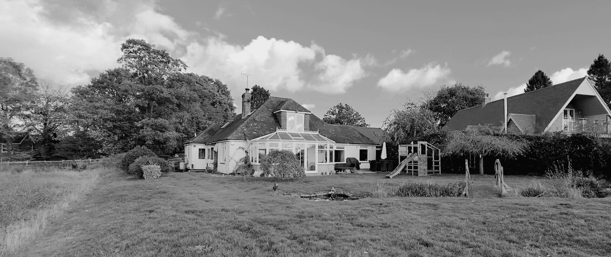
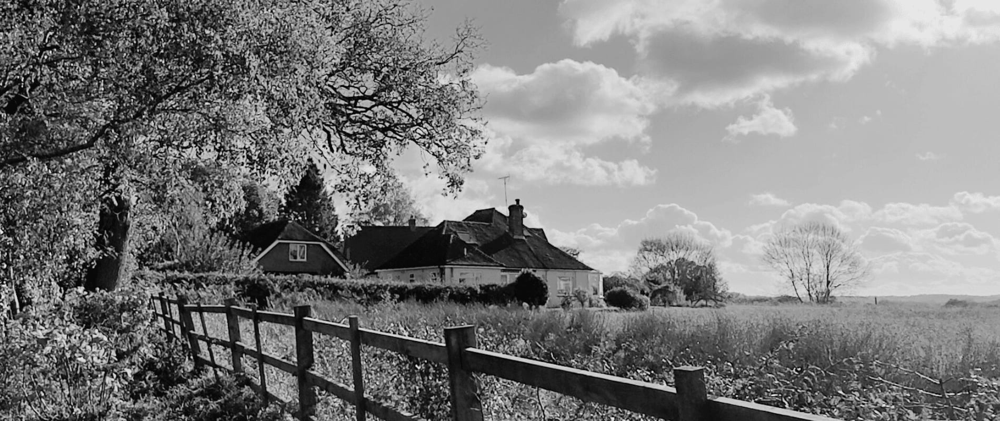
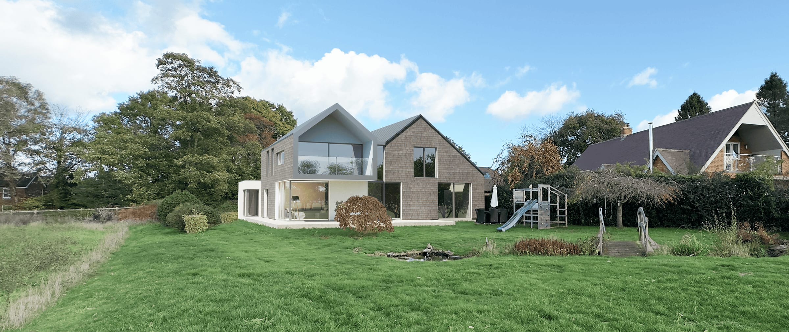
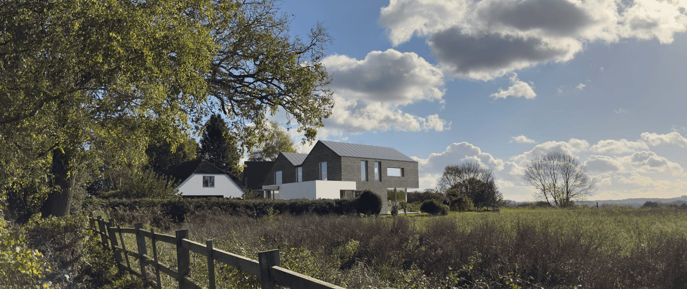

Planning permission has been granted for our architectural design to transform a 1960s chalet bungalow in Liphook, East Hampshire, into a modern, energy-efficient 5-bedroom family home.

Our project, located in the picturesque hamlet near Liphook, involves a significant remodelling and extension of the existing property. Situated next to open fields with far-reaching views, the design capitalises on its beautiful landscape setting.

Architectural Vision & Transformation

While the original 4-bedroom bungalow had been previously extended, our design reimagines the entire property. We are stripping back the old roof accommodation and conservatory to create a more cohesive and contemporary home. Key features of this residential transformation include:

Expanded Living Space: A stunning open-plan kitchen, dining, and living area with direct access to the garden.

Five Bedrooms: Converting the layout to include five bedrooms, with three principal bedrooms and a new master suite in the first-floor extension.

Welcoming Entrance: A completely reconfigured entrance, solving the previous layout's confined and poorly positioned entry point.

Light & Connection: A sequence of double-height spaces and a new landing bridge will connect the front and rear of the home, flooding the deep plan with natural light and offering unique vantage points over the living space and landscape.

Sustainable Design & A Fabric-First Approach

A core objective is to deliver significant improvements in energy efficiency. We are adopting a "fabric-first" approach by re-cladding the entire property with high-performance insulation and premium materials, including:

Natural cedar shingles for the primary cladding.

A standing seam zinc, double-gabled roof.

A green roof and a sleek, metal-framed glass canopy to highlight the new entrance.

This project showcases how thoughtful architectural design can modernise a chalet bungalow, enhancing its connection to the landscape while delivering a beautiful, functional, and sustainable home for the future.

