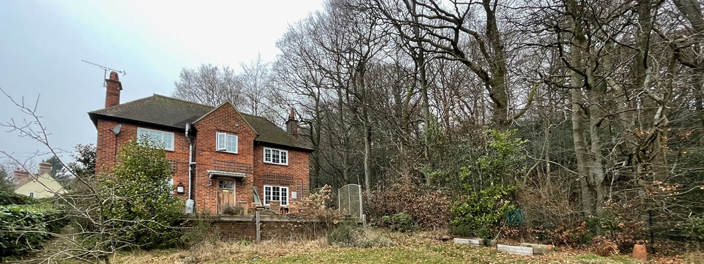

​Waverley BC has granted planning for our design to remodel and extend a 1950s detached house in Haslemere, Surrey.

The brief, to provide an open-plan kitchen & dining area, resulted in our design flipping the existing ground floor layout to benefit from garden view and access. This in turn enabled the conversion of an existing galley kitchen into a new study/guest suite. 

The remodelling of the existing property also includes a new building approach, entrance hall and staircase. Upon entering the property, the new layout will immediately open up to views across the new living areas as well as Haslemere's beautiful hillside views. The new circulation and staircase further enable a rationalised landing resulting in a generous, new family bathroom.

The modest, liner extension has been designed to maximise sunlight and views with a monolithic design. In order to retain an existing first floor bedroom, the massing blends a classic gable frontage with a mono pitched lean-to in a contemporary take of the original, garden facing house entrance.

