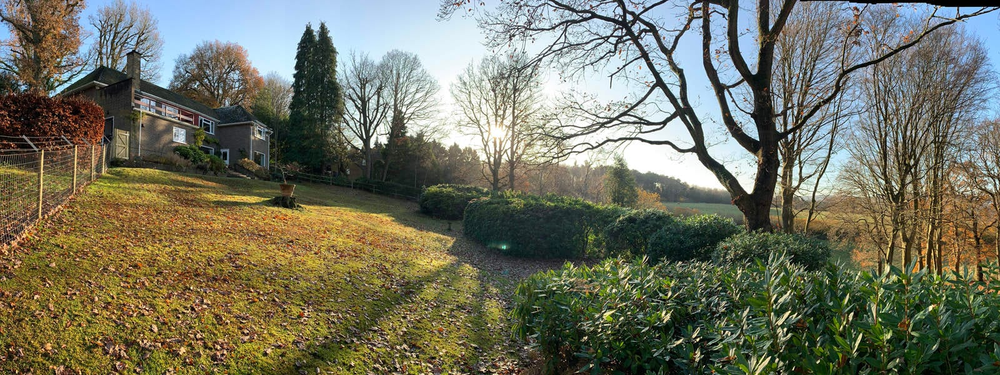

Our latest planning design in the South Downs National Park is now proceeding with detailed design for construction to commence in early 2021.

The existing 1960 property is located on a large plot near Liss, East Hampshire and had remained largely untouched since its construction. Our design will include the renovation of the entire building envelope to well-above building regulation energy performance standards. This will include the installation of an ASHP (air source heat pump) and photovoltaics.

The new contemporary extensions feature generous westerly glazing to take in the beautiful views. Our design includes a new double height atrium space with a first floor gallery-landing and a new master bedroom suite. In line with the Dark Night Skies Policy, nocturnal light spillage is carefully managed by our design to protect the environment.

​

