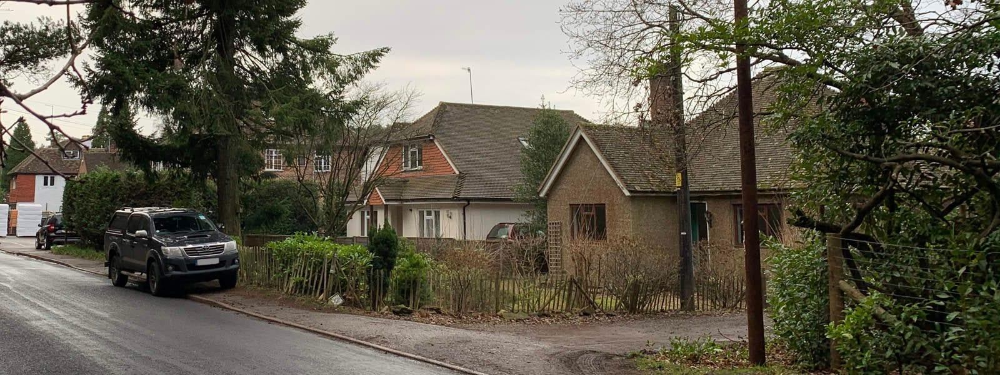
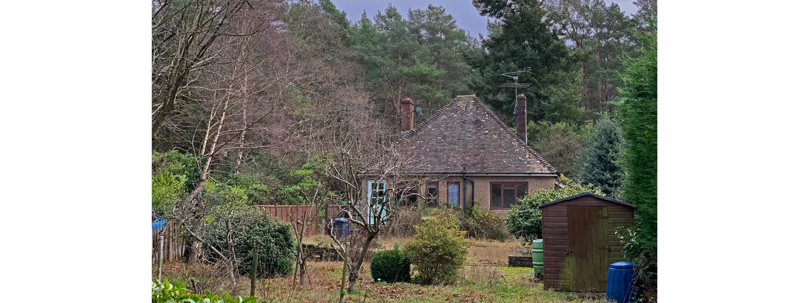
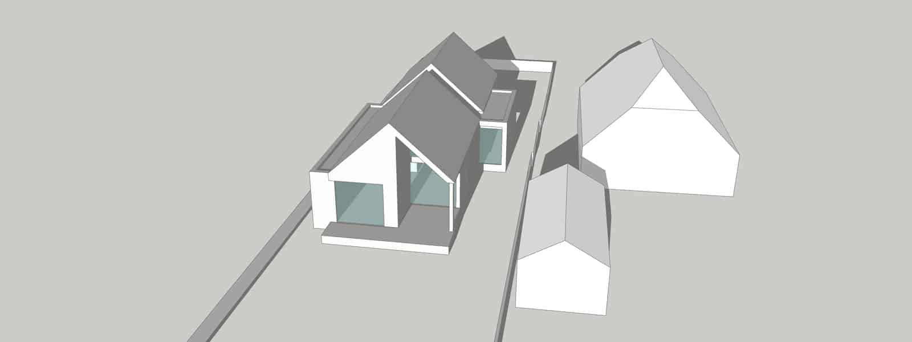

We are delighted that Waverley Borough Council granted planning permission for a new build family home to replace a dilapidated 1960s bungalow in Rushmoor, near Tilford, Surrey. This is a great example for intergenerational living with a sustainable design, in line with Passivhaus principles.

Our brief was to design a new, sustainable and wheelchair accessible three bedroom family home.

In order to deliver a fully accessible layout for the open plan kitchen, dining and living as well as all bedrooms and ancillary spaces, the accommodation is entirely located on one floor. This also includes a covered terrace to the rear with level access to provide a high quality, accessible external space. A newly dedicated parking area with electric car charging facilities and a ramped approach will further improve the access to the property.

The proposed new materials are clay roof tiles, tile hanging and facing brickwork, typical of the area to sympathetically blend with the surrounding vernacular and woodland setting. The building has been designed using Passivhaus principles and will feature a carbon-positive timber frame superstructure such as SIPs (structurally insulated panels). The installation of a heat pump, photovoltaics and a rainwater harvesting system conclude our sustainable design.

