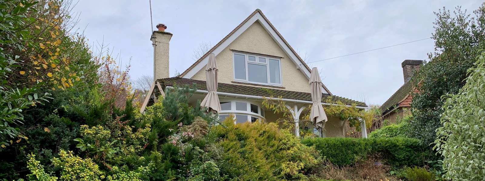
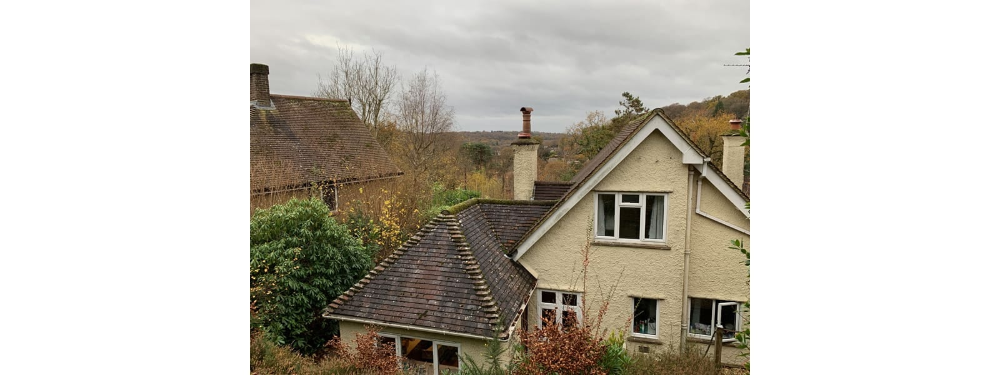
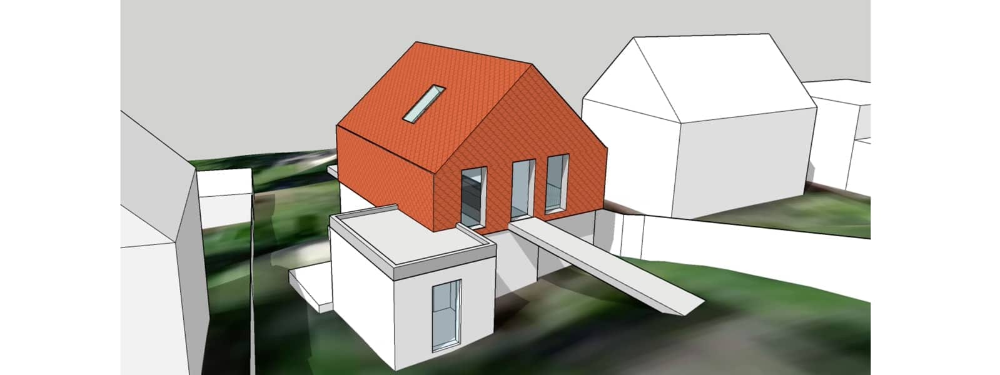

Waverley Borough Council has granted planning permission to modernise and extend a two bedroom, detached 1950s chalet bungalow in Haslemere.

Typical for Haslemere, this property sits on a steeply sloping site and is accessed from the lower level. Internally, rooms are disconnected from the garden and views are limited by large retaining walls and banks.

Our clients’ aspirations included a sustainable agenda, aiming to renovate the property to approximate the [Passivhaus EnerPHit](https://www.passivhaustrust.org.uk/competitions_and_campaigns/passivhaus-retrofit/) standard, the retrofit standard for existing buildings.

As is common for solid masonry properties of this age, this will require over-cladding the external envelope. Our new first floor extension will utilise SIPs as a light weight, high performance envelope for the new wall and roof superstructure, which also seamlessly integrates vaulted ceilings with larger spans.

Internally, the new first floor layout provides an open plan kitchen, dining and living space with access to the garden via a bridge link. Improvements will be made to the circulation within the property to allow direct access to all principle rooms. A small extension further improves the circulation, entrance and approach to the property.

A new air source heat pump (ASHP) in conjunction with underfloor heating will complete the transformation into a contemporary family home.

