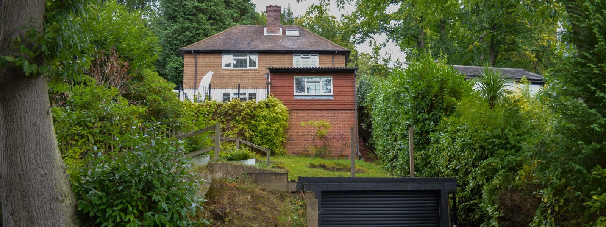

Waverley BC has granted planning for a two storey rear extension to a 1940s detached house in Haslemere, Surrey.

The existing family home had two prior extensions and is located on a steeply sloping site with dramatic views. Nevertheless, the current layout is introverted with cellular living spaces that are mostly disconnected from the garden and views.

Our design will remodel an existing rear extension and compliment it with a further two-storey extension in order to provide a new, open-plan kitchen, dining and living space with direct access to a prominent garden terrace. The first floor extension will deliver a new, contemporary master bedroom suite. Internal reconfigurations will also include a new staircase and rationalised circulation, maximising natural light and views.

A new holistic design approach will unite both the existing and the new, sympathetic to the original building.

