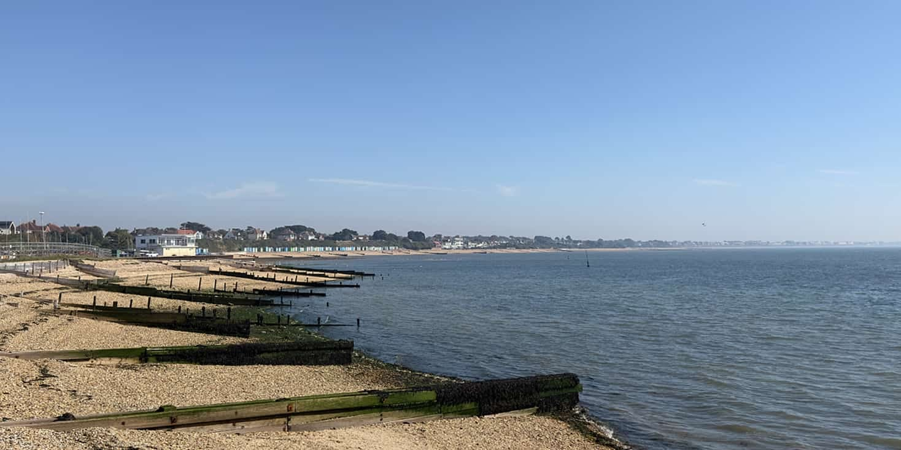
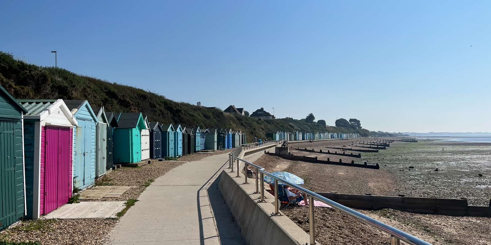
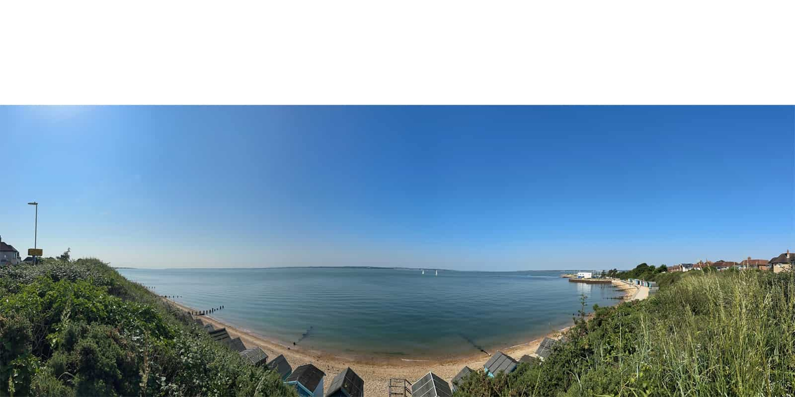
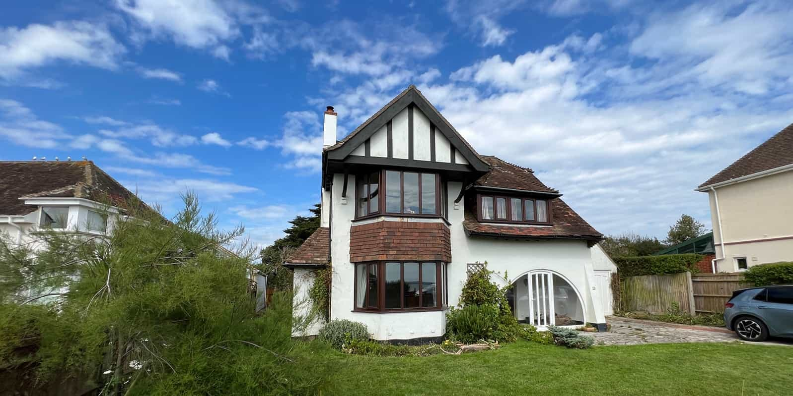
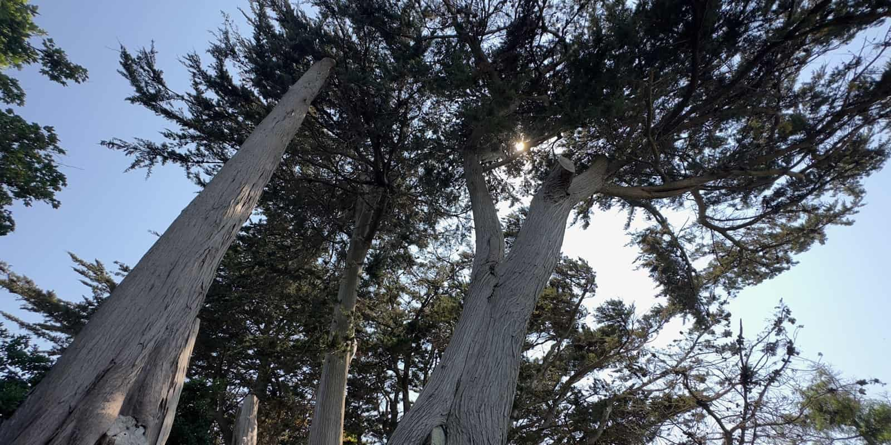

Fareham BC has granted planning for our design to remodel and extend a 1920s sea-front property in Hill Head, Hampshire. The design, to modernise and extend a mostly original 1920s chalet style dwelling, delivers contemporary family living in a spectacular location. 

Front, side and rear extensions will replace dated dormers and open up the previously restricted layout. In addition to a seaside facing sitting room, new open-plan kitchen/dining and family rooms will address the garden as well as a new sheltered courtyard. A five-bedroomed layout will deliver a new Lifetime Homes Standard compliant guest suite on the ground floor and two new sea-front facing bedroom suits on the first floor. A partially double-height, central study area will boast unencumbered sea-views with a viewing balcony and also address the sheltered courtyard garden.

Significant energy efficiency improvements on the entire building fabric, integrated photovoltaics and the even distribution of daylight and cross ventilation will complete this transformation.

