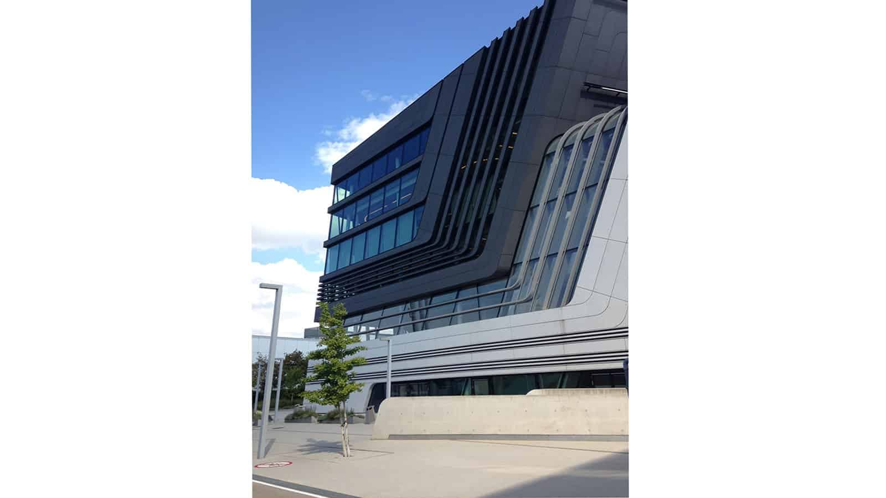
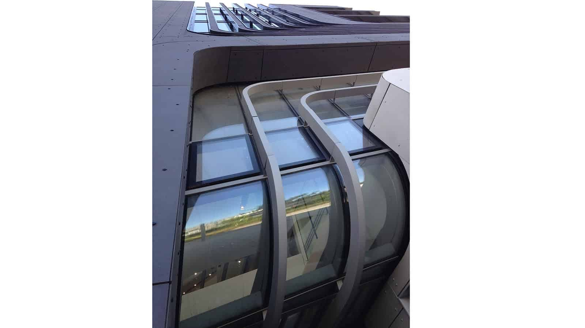
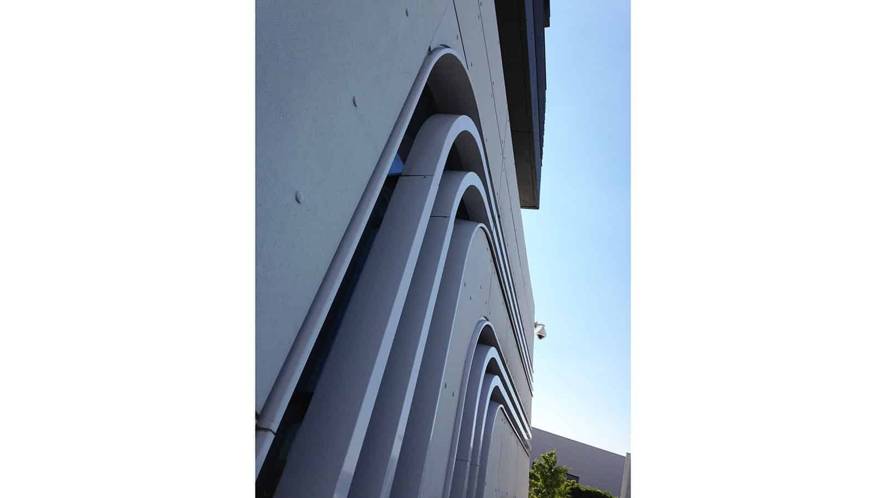

In July we took a study trip to the Library & Learning Centre at the Vienna University of Economics and Business designed by [Zaha Hadid](http://www.zaha-hadid.com/architecture/library-and-learning-centre-university-of-economics-vienna/). We were incredibly impressed by the implementation of the complex geometries throughout the building and its continuing fresh look. Completed in 2013, prior to her death, this building forms part of the campus at the largest business and economics university in Europe, accommodating 23,000 students. 

The centre, which spans an area of 28,000m2, is home to a library, learning support services, an auditorium, workspaces and classrooms as well as a bookshop and cafe.  Definitely worth a visit!

