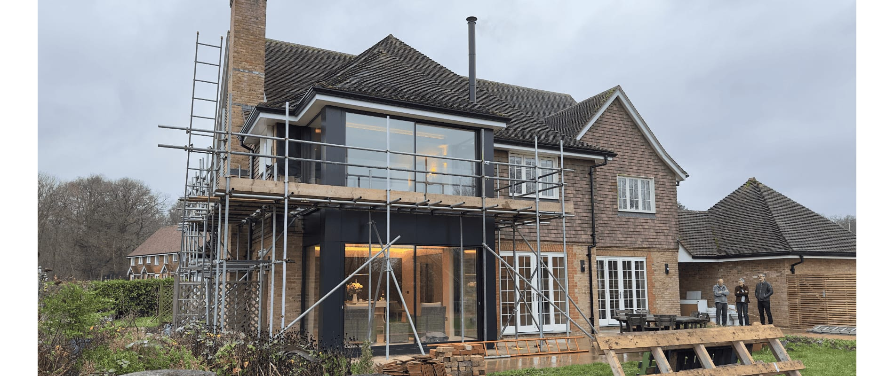
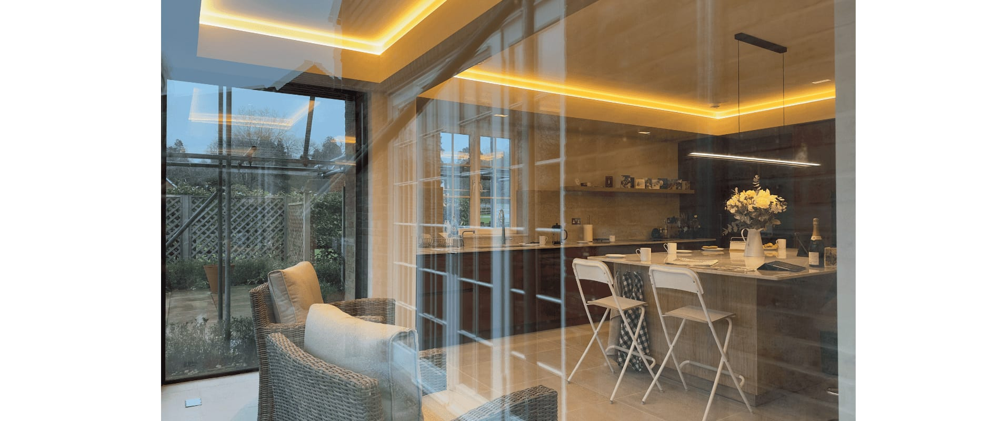
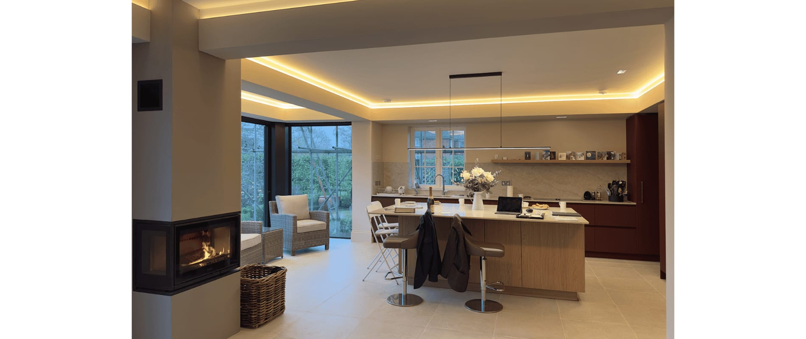
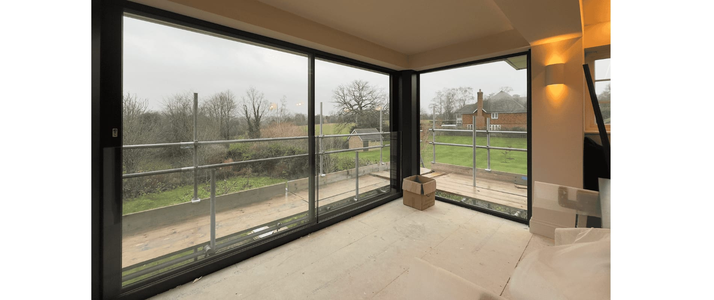
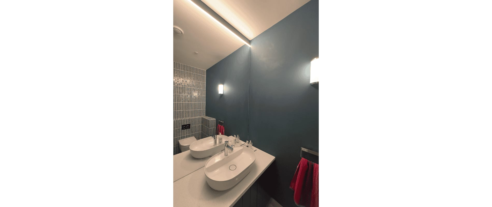
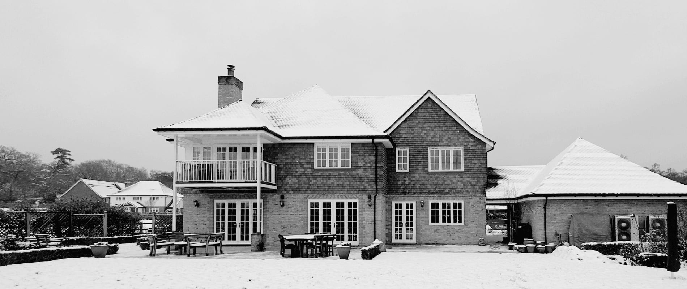

A first peek at our nearly completed Shackleford, Godalming Surrey remodelling, interior design and new two storey bay window reveals great craftsmanship from all the team.

The main aspect of good architecture is a functional layout and resolving dysfunctional spaces is therefore at the core of our design. Most of the time, this work relates to historic properties with ill considered, later extensions. However, this was equally true for this 2010 property which our clients found lacking in functionality and character.

Whilst providing adequate thermal performance, renewable technology and ample of space, the existing arrangement resulted in introverted, disconnected and unattractive living accommodation.

Our brief therefore, was to reconfigure the interior to provide an optimised open plan kitchen, dining and living room layout, a new pantry, reconfigured cloak room and utility as well as a remodelled master bedroom suite with bespoke furniture and new bathroom layouts.

Lighting, natural as well as artificial was at the heart of our redesign, with the relocation of the kitchen to benefit from garden views and the early morning sun.

The opportunity for a two storey metal clad bay window presented itself as the replacement of a tired looking balcony which nevertheless delivered most of the substructure already in place. This new, full height glazed bay frames views and provides a new focal point from dawn till dusk.

architect

ArchitectureLIVE

lighting & interior design

ArchitectureLIVE

contractor

[Greenbuild](https://www.greenbuildconstruction.co.uk)

structural engineer

[D4S](https://www.design4structures.com)

glazing

[Maxlight](https://www.maxlight.co.uk)

