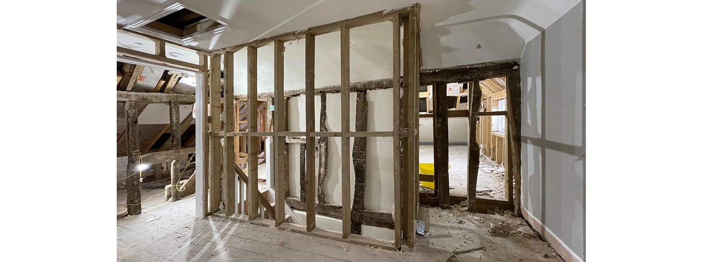

It has not been an easy start onsite at our project in Lodsworth, awaiting the arrival of the bat licence. It was eventually issued during the first cold week in early December due to a, nowadays standard, Covid-related delay. The ecologists found 14 bats which were rehoused in bat boxes and this then finally allowed us to get started with the roof alterations.

So, back into another lock down, we are nevertheless progressing at full pace, with the historic timber structure exposed for inspection, treatment and the new interior layouts starting to take shape.

Can you guess the name of the bat pictured?

​

