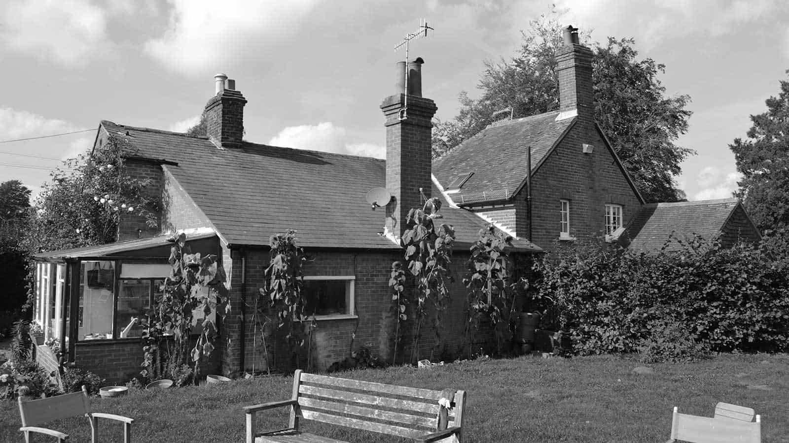
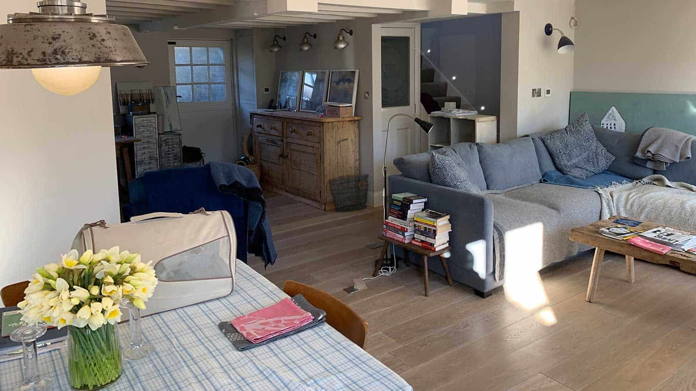
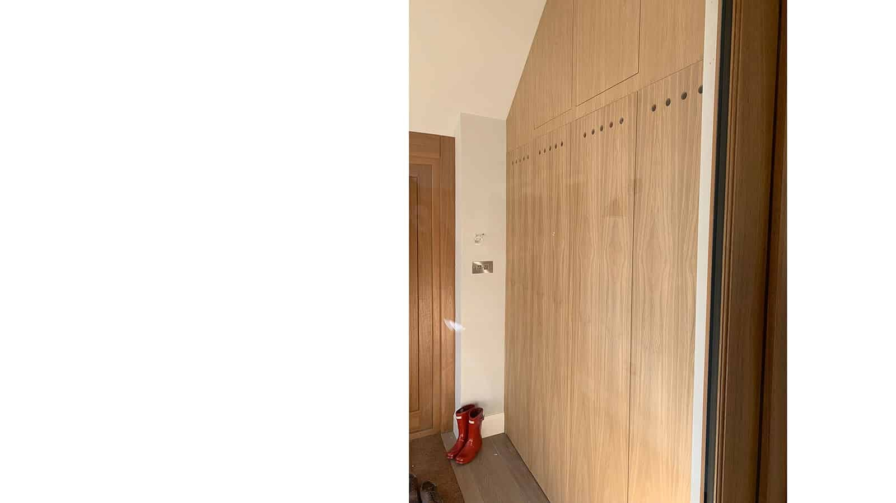
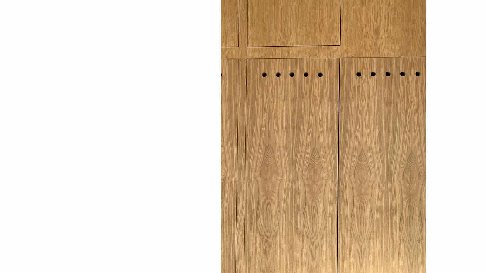
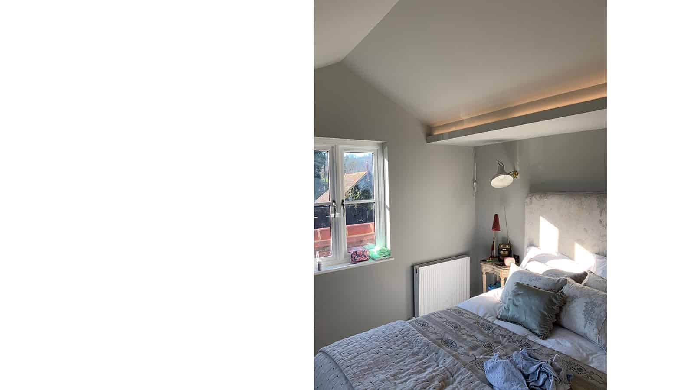

The brief, to adapt and extend the existing house to form a three bedroom property and to improve the living accommodation and its connection to the garden. Improvements to the cottage's energy efficiency and daylighting levels throughout were also requested.

This 19th Century semi-detached cottage is located in a prominent position, overlooking the village green in Farley Green, Surrey. The site is located within the green belt, in an Area of Great Landscape Value and AONB. The property had been extended in the 1940s but remained largely unaltered since the 1970’s.

Historic adaptations had not been sympathetic to the character of the cottage, with a previous single storey rear extension resulting in a large, unsightly ‘cat-slide’ roof to the rear. The extended part of the roof also had a lower pitch, clad in slate and out of character with the original clay tiled roofs. A number of ill-proportioned 1970s style single glazed windows to both the front and rear of the property, together with a tired looking lean-too conservatory that was beyond its useful life, further detracted from the charm of the cottage.

Our design replaced the large cat-slide roof with a first floor rear extension, mirroring the street side proportions and matching the clay tiling. The extension provided two new bedrooms within the existing footprint of the property. Together with a replacement conservatory, the extension opened up the ground floor layout to provide contemporary, open plan living and a reconfigured kitchen layout.

The lowering of the existing cottage slab delivered a much improved floor to ceiling height for the entire ground floor. The vaulted ceilings in the new bedrooms likewise deliver ample daylight across the interior.

Replacement windows and doors throughout with newly proportioned panes, sympathetic to the period character of the property, and a new central heating system in addition to the existing wood-burning stove concluded this renovation resulting in an energy efficient property.

architect

ArchitectureLIVE

engineer

[CWPM Consulting](http://cwpmconsulting.com/)

contractor

[Strongbuild](https://strongbuild.co.uk/)

