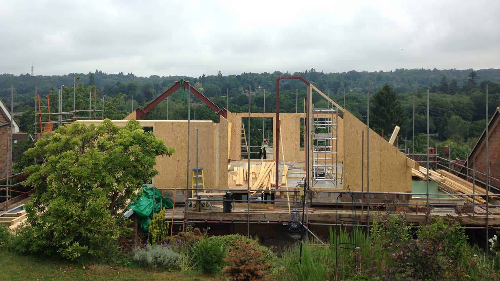
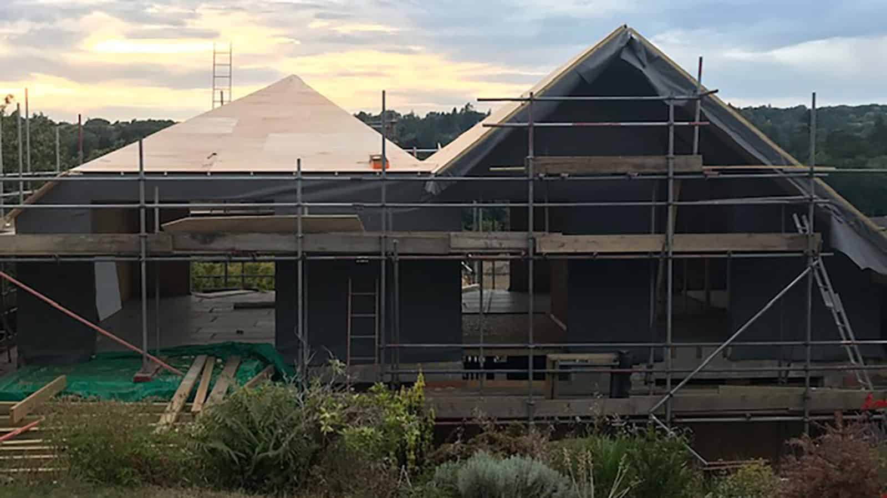
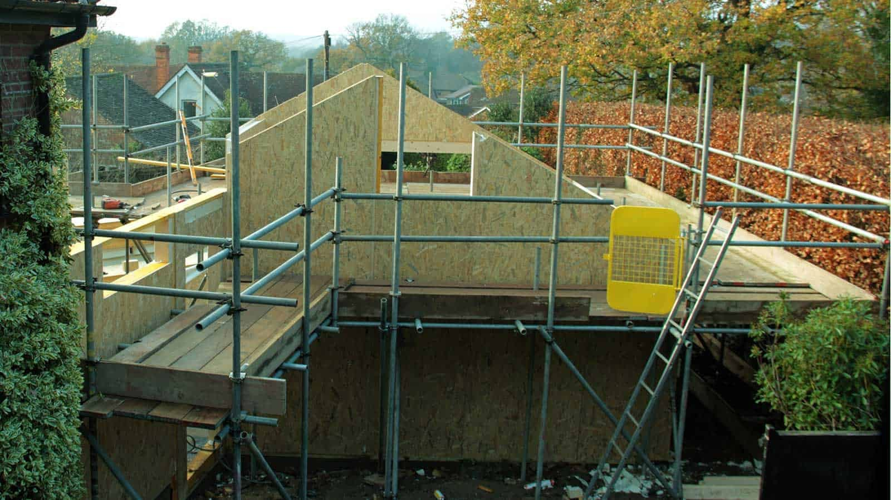
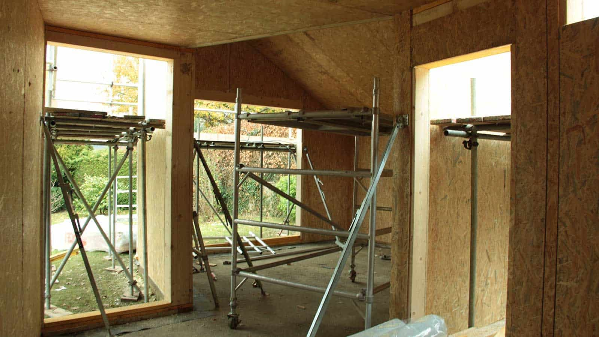
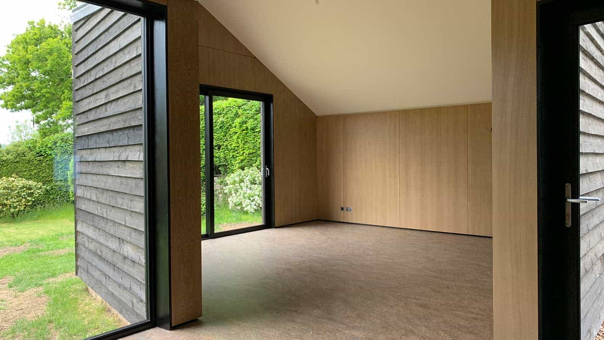

_“One thing is certain: .., without a committed client, a decent site and an appropriate budget, nothing of any quality of significance is likely to emerge, whatever the quality of the architect.”_  [_Paul Finch_](https://worldarchitecturefestival.com/worldarchitecturefestival2024/en/node/newsarticle-a-question-of-leadership?type=NewsArticle&eea=V3FYMU1lbHdkV3pUeVhnRU53akxUTlFXVC91Sk92aXNuY2dPV3BXalJKWT0=&utm_source=acs&utm_medium=email&utm_campaign=FABS_WAF_EVE_NEWSLETTER_2024_JANUARY&deliveryName=DM206301)

This statement highlights the delicate relationship between three elements at play during a construction project - the client, the architect and the budget (decent sites an extension of the appropriate budget). Aspiring to do the _significant_, the definition of which is of course highly personal, we are therefore on a perpetual search for the committed client with the appropriate budget.

Unfortunately, even committed clients are stretched. A difficult aspect of the design process therefore, is to curtail unfunded expectations and assist our clients to make the budget stretch further. This is not a new quest, as historically every area had its economic challenges. However, technological advances favour the here and now. Like sustainability, Passivhaus and prefabrication/SIPs have entered the mainstream of construction. And it is particularly for the committed client that such technological advances now bear fruit. 

We started designing with SIPs, [Structural Insulated Panels](https://www.kingspan.com/gb/en/products/structural-insulated-panels/tek-building-system/) in the domestic sector a decade ago, and have since completed [new-builds](https://www.architecturelive.co.uk/projects/new-build-retirement-house-fareham-hampshire/) as well as [extensions](https://www.architecturelive.co.uk/projects/1960s-bungalow-haslemere-surrey/). With every project anew, the speed of construction impresses. Whilst the aspect of prefabrication ensures that technical issues are resolved well in advance at a high level of precision, intersections between SIPs and existing buildings can be a challenge. However, such discoveries have spurred us on to develop robust details, ensuring high levels of performance.

Ultimately, SIPs are a really cost effective way of constructing exciting spaces at an unmatched speed, capable of become something _significant_.

