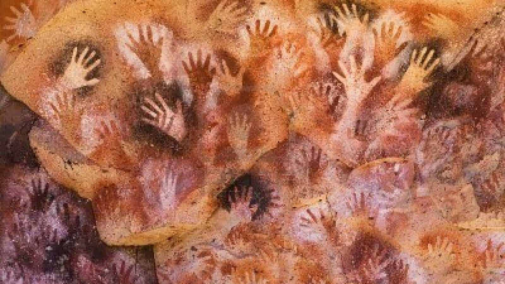
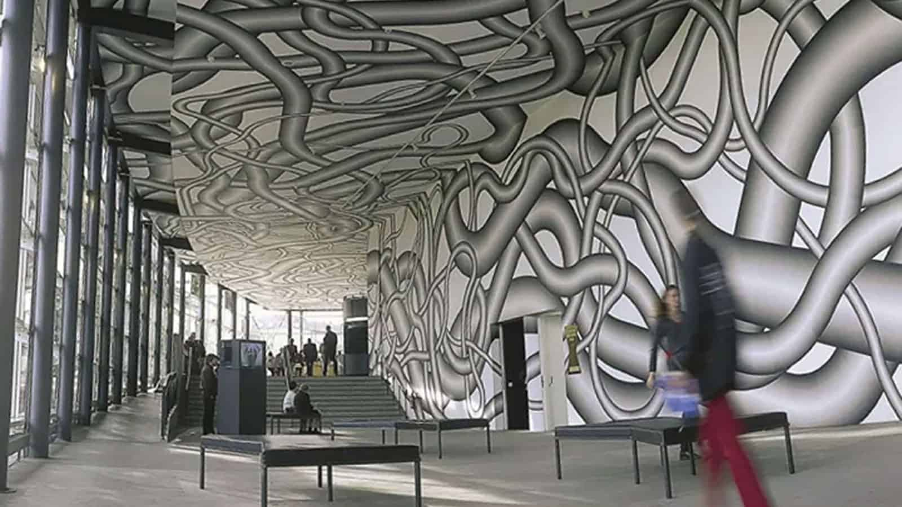
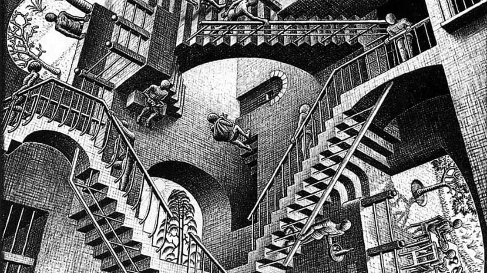
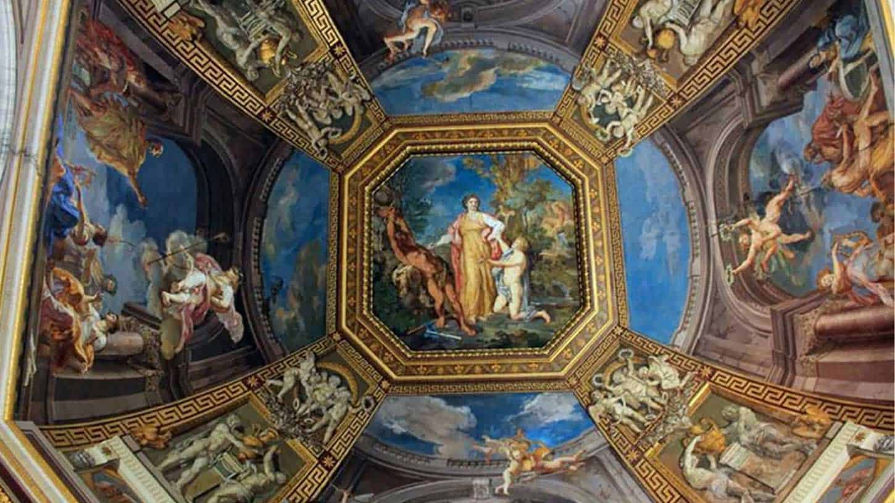

During our last visit to St Bartholomew's School, Irene Konschill held a workshop with a group of 6th form students who entered a competition to design the mural to adorn our shortly to be completed conference centre.

Using examples of art through the ages by Roy Lichtenstein, Maurits Cornelis Escher and Peter Kogler amongst others, Irene  highlighted the following 5 key criteria to progress the design from concept stage to realisation. The final design will be a collaboration between the shortlisted young artists. 

1\. A question of scale — close up/far away — what do we perceive? — flagship status — advertising — printing dots — the material

2\. Why wall? What wall? On the wall!

3\. Time capsule/time witness — you spend so much time at school — this school — what are your hopes and fears? — share them — as an artist — share yourself — 2018 — you — here — in this place and time — on the wall

4\. 3D paintings to give perception of depth — there is more here — space on the wall — not just a surface

5\. What is community? — a question of scale — how do building and mural interact — colour mix — how it all adds up — think contextual

​

