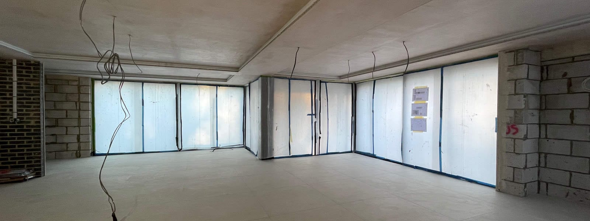

Great progress has been made at our country home remodelling, extension and renovation project in Lodsworth, West Sussex as we enter the final stage of this build.

The external envelope has been upgraded well beyond current building regulation standards, including the existing stone walls, which had suffered from historic water damage and previously poor remedial works. As a result a new fully-breathable, high-performance, insulation and render system has been applied to the inside of all existing stone walls.

Powered by a ground source heat pump, a new plant room extension runs a low temperature underfloor heating system for the entire property and all existing glazing units have been replaced. Traditional openings have remained with transom and mullion timber windows by [Chittleburgh Joinery,](http://www.chittleburgh.co.uk/) juxtaposed with extra-large ÜberSliders by [Kloeber](https://www.kloeber.co.uk/). The bespoke new kitchen fitting is next.

​

