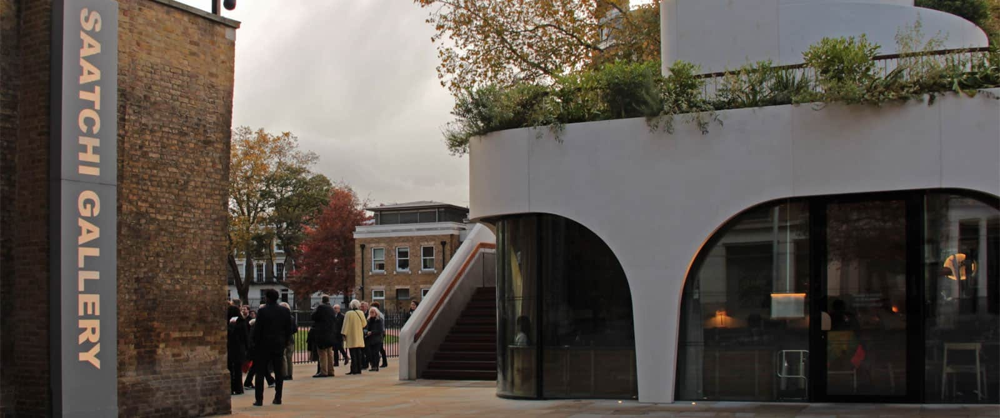

The new centrepiece of the Duke of York Square on Kings Road, ‘Vardo’ restaurant, is now open!

The building, designed by Nex-, features Kollegger’s innovative [Descender Fronts](http://www.kollegger.net/en/) in the shape of three 9m long curved, double glazed facade units which fully retract into the basement.

These Descender Fronts are the first to be installed in the UK and will allow the restaurant to benefit from an innovative space concept, providing alfresco dining and barrier-free thresholds. 

For more information on the restaurant, click [here](https://www.vardorestaurant.co.uk/).

