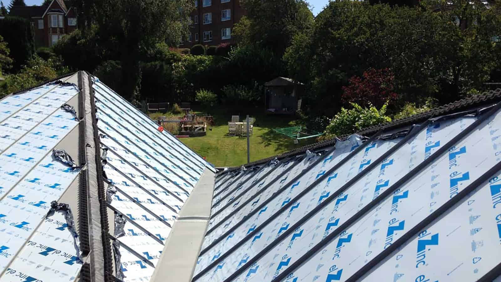
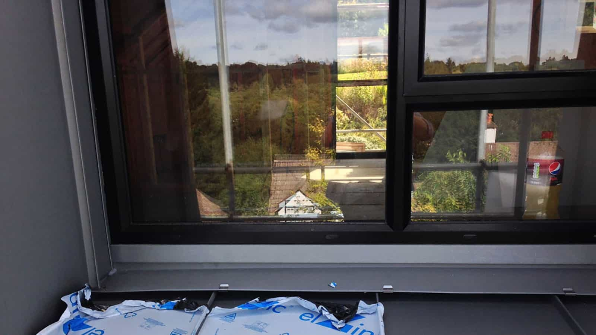
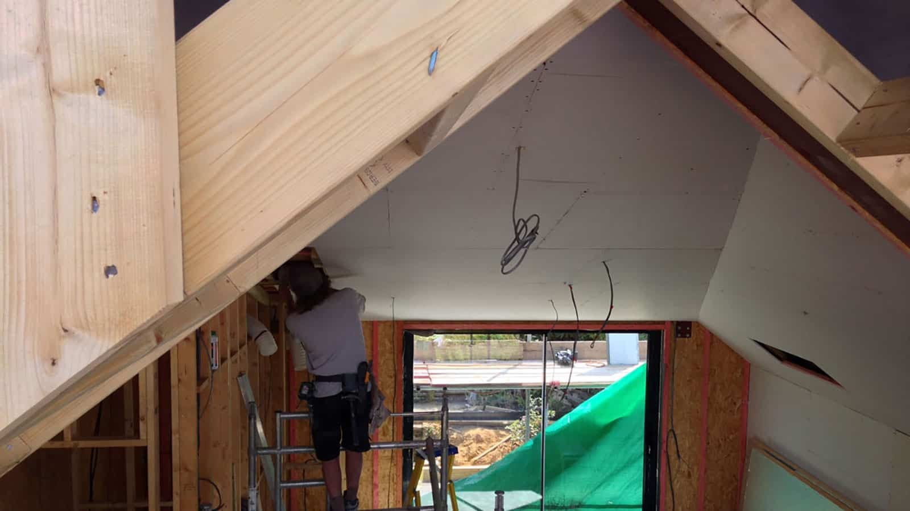

Our bungalow conversion into a 5 bedroom upside down house has reached a new milestone. The striking zinc roof installation is now complete.

New polyester powder coated aluminium glazing has been installed throughout. This includes double aspect slimline aluminium sliding doors in the open-plan kitchen and dining area. First fix building services are also finished, with the installation of the plaster boarding onto the SIPs superstructure in full swing.

