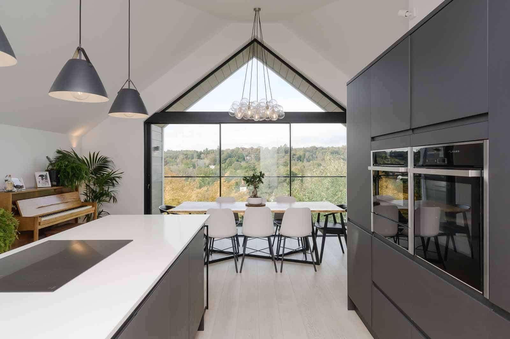
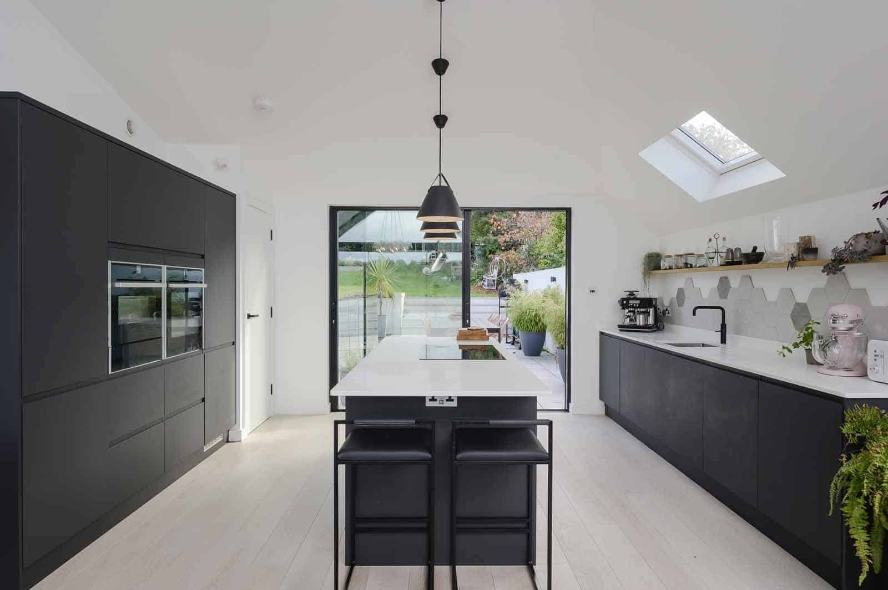
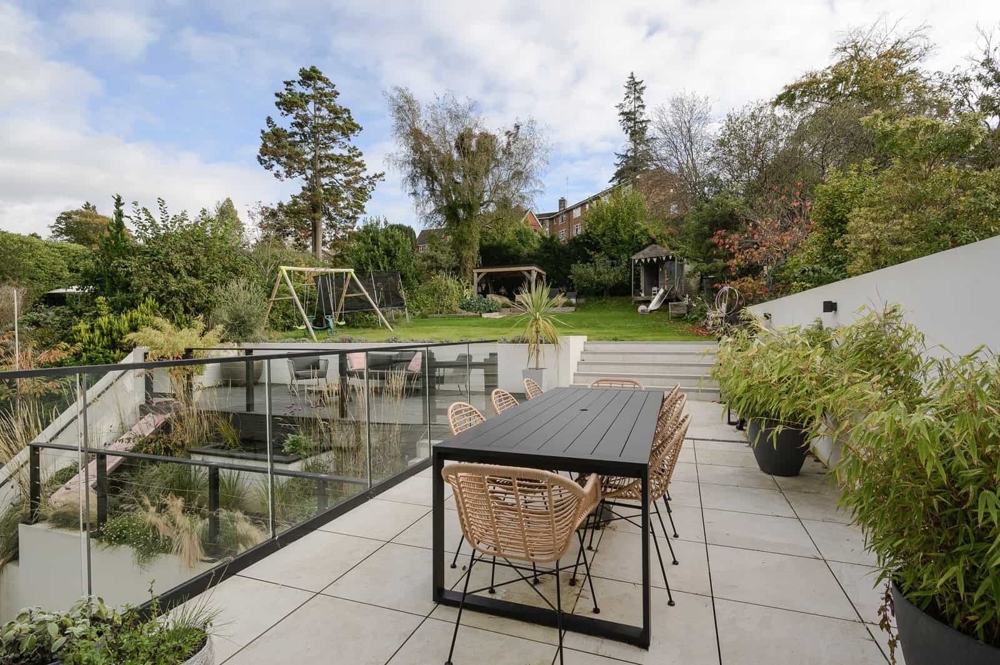
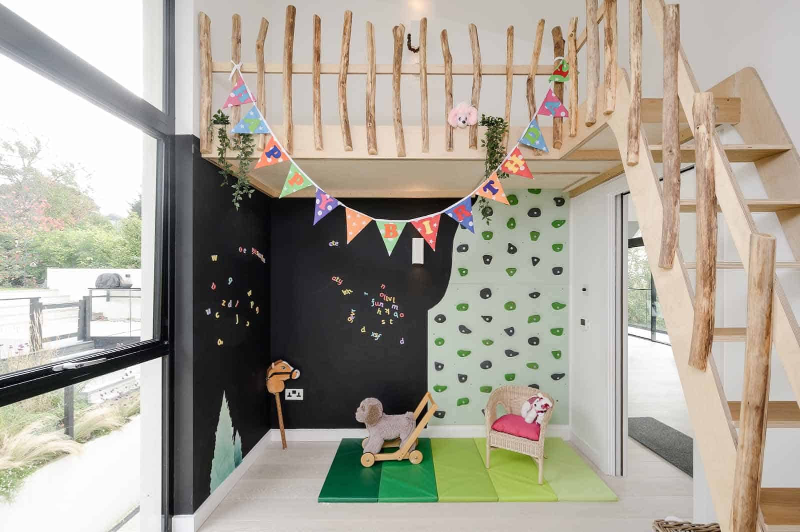
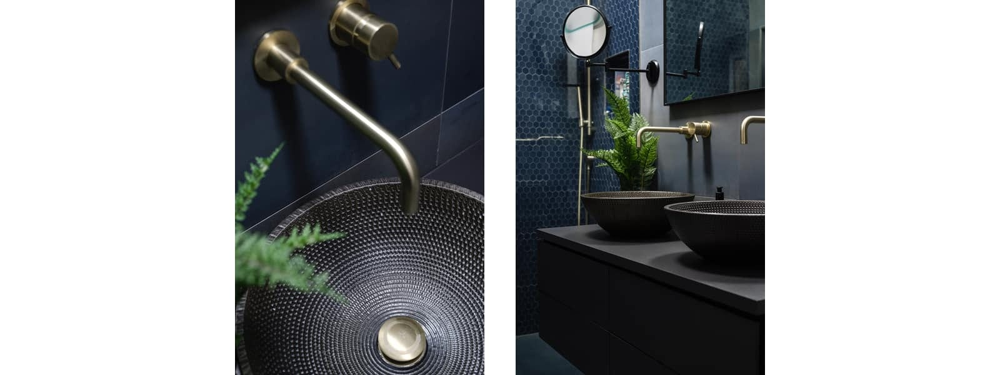

### _“Our architects pushed the boundaries of our imagination, and we’re so glad they did!”_

### _\- Mary, Haslemere, Surrey_

We were delighted to revisit our 1960s bungalow conversion into an upside down house in Haslemere, Surrey, accompanied by professional photographer, Chris Murphy.

The external works and landscaping are now complete and mellowed in, providing a beautiful, seasonal backdrop for the spectacular gable view.

This project bears testament to the collective, creative force a successful client and architect team can deliver. Thanks to our wonderful clients.

To read more about this project, click [here](https://www.architecturelive.co.uk/projects/1960s-bungalow-haslemere-surrey/).

