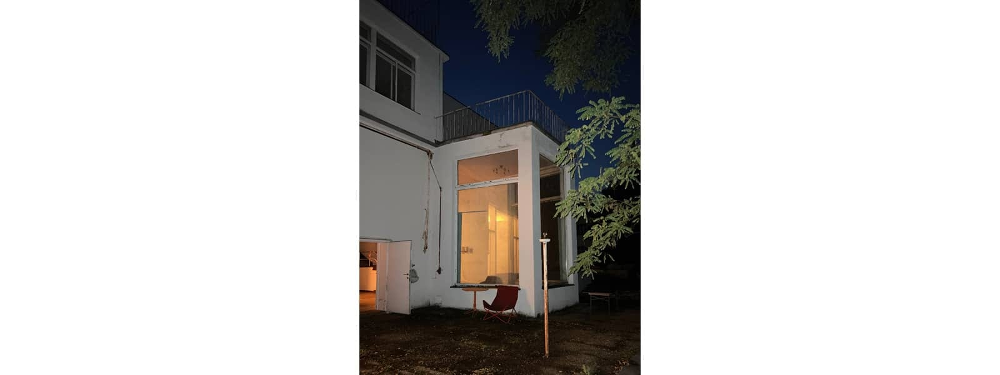
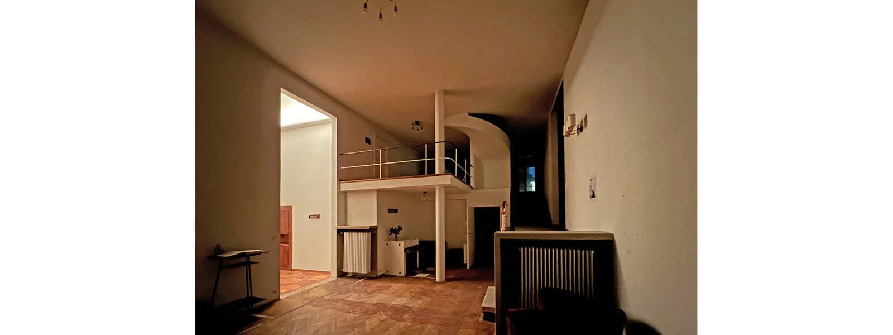
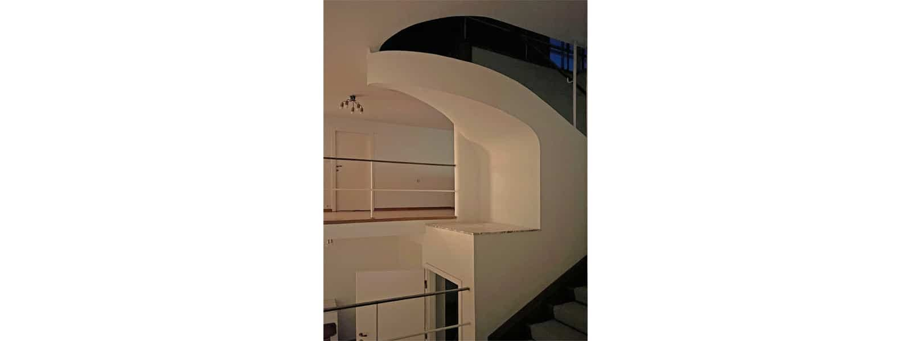

This summer we had the opportunity to privately view one of Vienna’s Modernist architecture marbles - [Villa Beer](https://www.villabeer.com/home) by Josef Frank and Oskar Wlach 1929-1931.

The Villa, which has recently come under new ownership, is currently completing a detailed process of historical analysis in order to gain approval from Vienna’s heritage department for complete renovation. Upon completion of the renovation, it will become accessible to the wider public as a museum and also house artists for projects.

The context of this building, in Vienna’s 13th district, known for many historically significant villas, such as Adolf Loose’, is well worth a stroll around. For us, the experience of Josef Frank and Oskar Wlach’s architectural masterpiece provided a surprise encounter of many familiar themes we seek to address in our own projects.

The subject of defined functions within an open-plan layout and the use of a volumetric approach to orchestrate light and views throughout, have been expertly addressed with timeless details. The historic sample surfaces laid bare, give witness to a fully integrated interior design concept complete with furniture and lighting.

Having been credited to be the most important example of Viennese living culture from the inter-war period, Josef Frank’s concept _“Haus als Weg und Platz“_ - the house as a journey and place, is something we too seek to implement in every project. The progression through the house, seemingly open plan (on the lower floors), is nevertheless carefully orchestrated to offer places to linger with restricted views that frame the desired connection to the garden and further connecting parts of the interior. Even the accentuation of the perspective view was used as an element of design.

