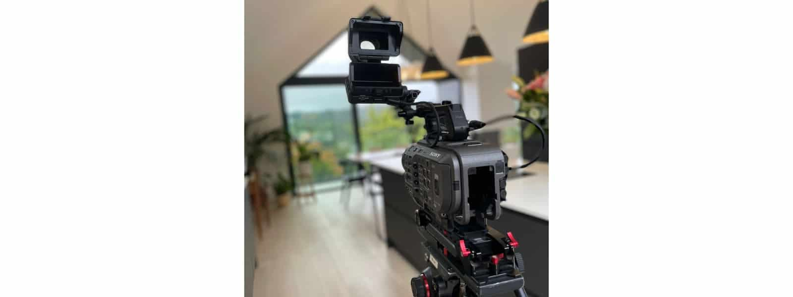

We are delighted to have been shortlisted for this year’s Waverley Design Awards with our [bungalow conversion](https://www.architecturelive.co.uk/projects/1960s-bungalow-haslemere-surrey/) into an upside down house in Haslemere, Surrey.  At the previous awards held in 2018/2019, our design for a single storey, rear and side extension to a detached property in Haslemere was awarded [Highly Commended](https://www.architecturelive.co.uk/2019/03/we-are-celebrating/) in the Alterations & Extensions category. A great success for the smallest project to be awarded. This time, our design will be considered for two categories - New Buildings & Developments and Sustainable Design & Construction. We will welcome the judges at the property in mid October with awards being revealed in February 2023. This will also be the time when our project will be featured on Channel 4. So watch this space!

