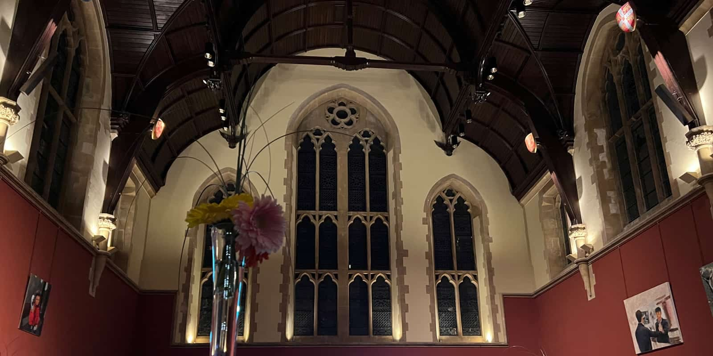
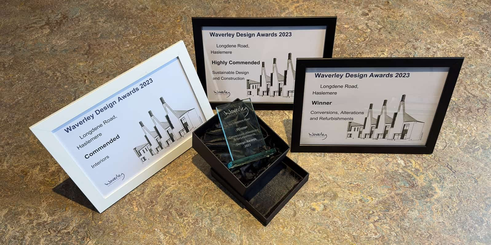

We were delighted to attend the [Waverley Design Awards 2023](https://www.waverley.gov.uk/Services/Planning-and-building/Heritage-trees-and-design/Design/Design-Awards#Categories) ceremony in the stunning setting of Charterhouse school’s historic hall. We were even more delighted to receive not one, but three awards!

Thanks to the judges’ sensitive consideration, categories and submissions were adjusted to better reflect the nature of the submitted projects. We were therefore also considered for the Interiors award, which _commended_ our project for its bespoke staircase design, the impact of the well designed fenestration, which carefully frames the views and provides daylight across the entire open plan, first floor layout as well as the pink garden slide and the play room climbing wall. 

Our _highly commended_ Sustainable Design and Construction award recognised our long term commitment to a Passivhaus inspired 'fabric first' approach for renovations, which was executed with a twist, replacing a poorly performing, 1960 bungalow roof with a new high performance, prefabricated SIPs extension. 

The original New Buildings & Developments category was split into new builds, extensions only and the Conversions, Alterations & Refurbishments award - which considered projects that holistically transformed, remodelled and extended the existing property. This was [_our Waverley Design Awards 2023 winner_](https://www.architecturelive.co.uk/projects/1960s-bungalow-haslemere-surrey/) and we were delighted that the judges agreed with our strategy to repurpose a tired looking bungalow as a contemporary, upside-down family house with level garden access via a bridge link. 

Congratulations to our fellow winners!

