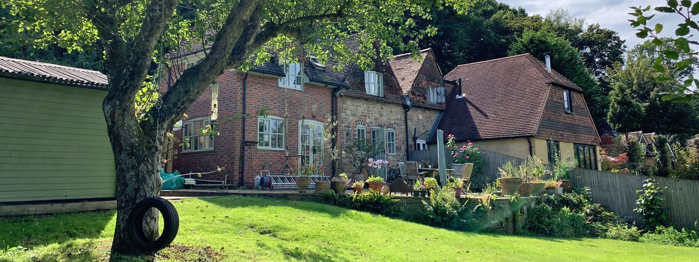

The brief, to extend and reconfigure a Grade 2 listed, semi-detached cottage to provide contemporary family living within the Haslemere conservation area.

Whilst set within the Haslemere conservation area, this cottage is an isolated property in the Surrey vernacular style directly adjacent to a busy through route. The site falls by one storey from the road level to the north-facing garden. The existing approach and entrance are immediately adjacent to the road yet below the road level and partially hidden behind a boundary wall.

The cottage has previously been extended and currently relies upon through-room circulation on the ground floor, compromising the use of the living accommodation with a confined and dark entrance layout.

Our design replaces the existing porch built in 2000 with a slightly larger louver and glass structure that provides a welcoming building approach. The exterior natural oak louvers will function as a privacy screen for passing traffic whilst allowing natural light directly into the depth of the building.

The new porch also allows for a new and separate circulation route, freeing up the existing living accommodation with more efficient use and accessing a further new rear extension. This contemporary open-plan living, dining and kitchen space will be tile hung with a green roof. It will maximise the currently under-utilised garden setting and views onto a listed tree whilst being located entirety behind existing building lines, thus retaining the character of the Haslemere conservation area.

