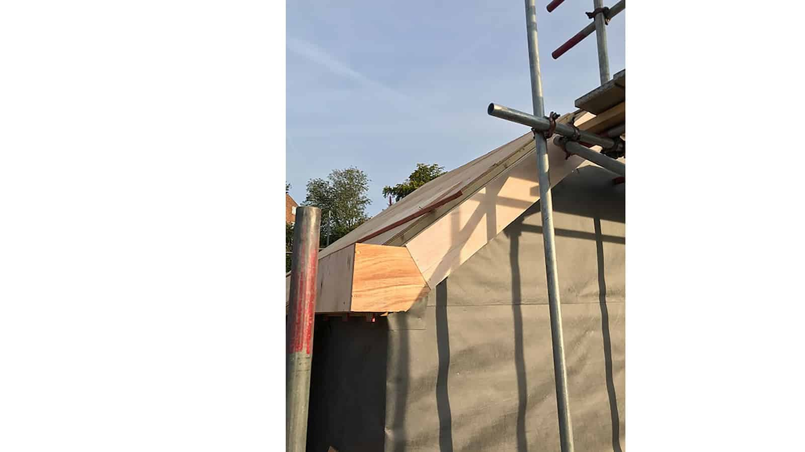
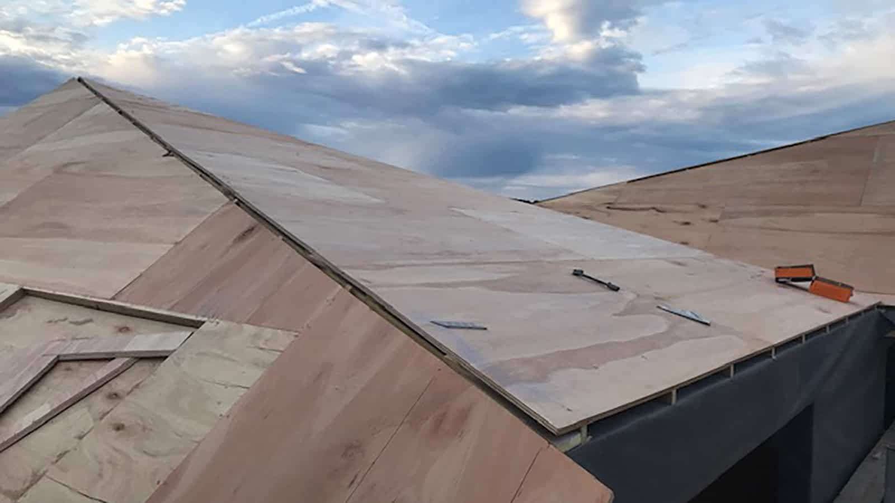
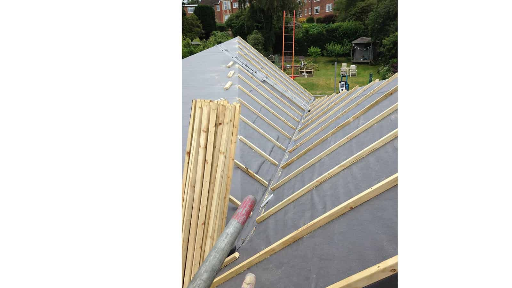
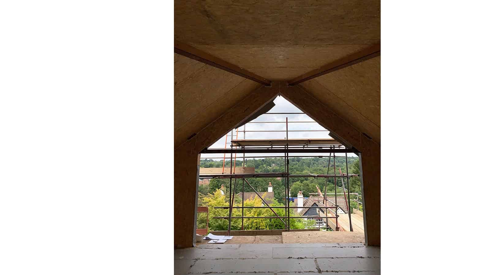
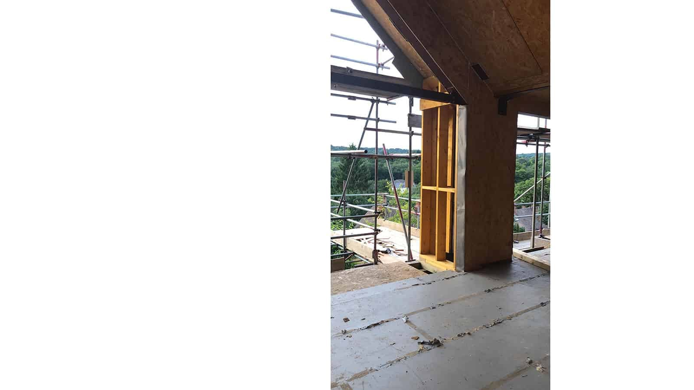
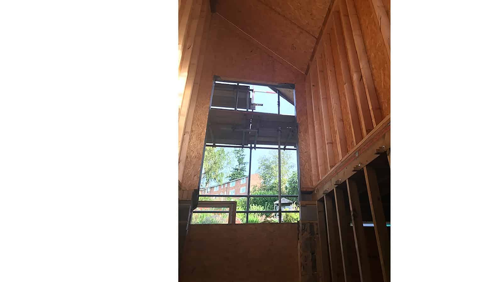

Amazing progress is being made at our contemporary 1950s bungalow conversion in central Haslemere, Surrey. The SIPs superstructure is now complete and the new, double gabled zinc roof is going up. Internally, the new spaces are starting to take shape with a new open plan stairwell and living, dining and kitchen. 

As part of a low carbon heating strategy, this property will benefit from an air-source heat pump and building services first fix are imminent.

​

contractor

JCT Project Services Ltd

SIPs

[Bentley Projects Ltd](https://www.bentley-projects.com/)

roofing contractor

[Kingsley Specialist Roofing](https://www.kingsleyspecialistroofing.co.uk/)

