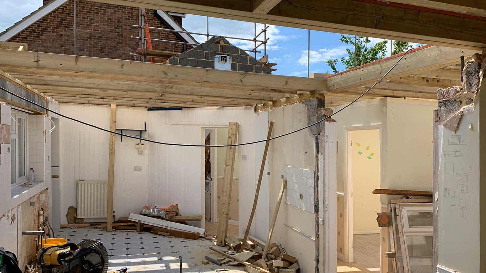
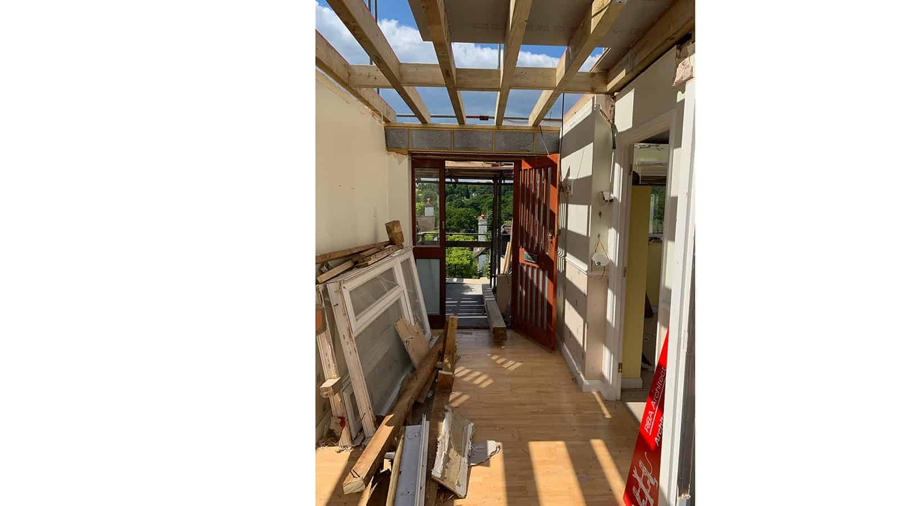
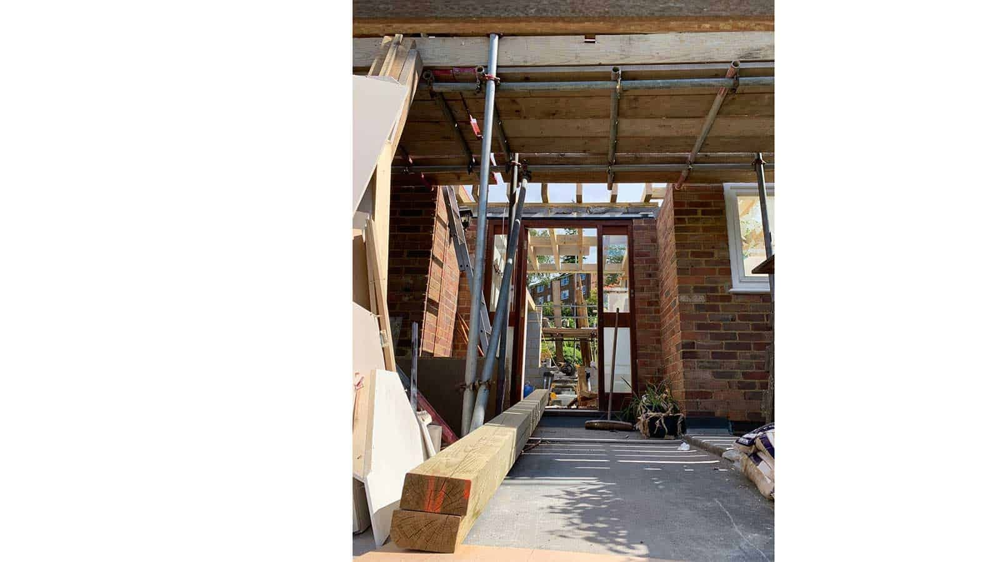

Work has begun on our project, a soon-to-be upside down house in the heart of Haslemere. This latest project is a complete reconfiguration and extension, transforming a 1950s bungalow into a striking, contemporary, two storey family home. 

The new extension superstructure will take shape in just 4 weeks, utilising a structurally insulated panel system (SIPs), thus radically reducing the construction period and delivering high levels of thermal performance for the new shell.  

This project is managed as a self-build, thanks to a highly involved client team, supported by ArchitectureLIVE.

